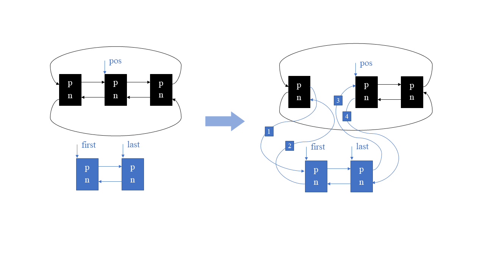
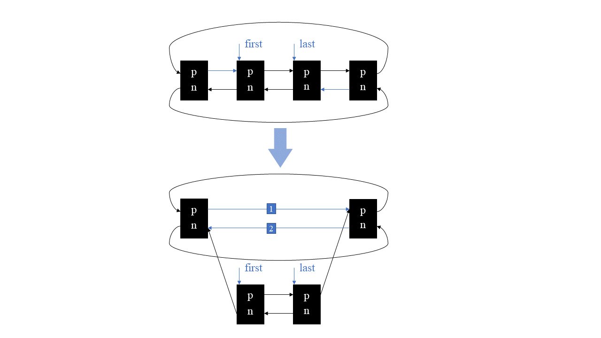
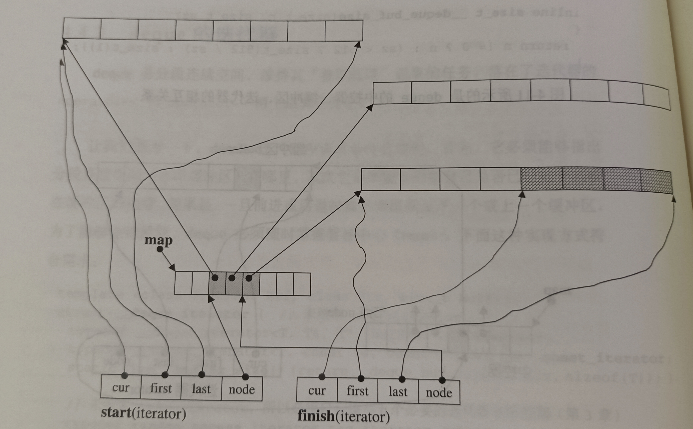
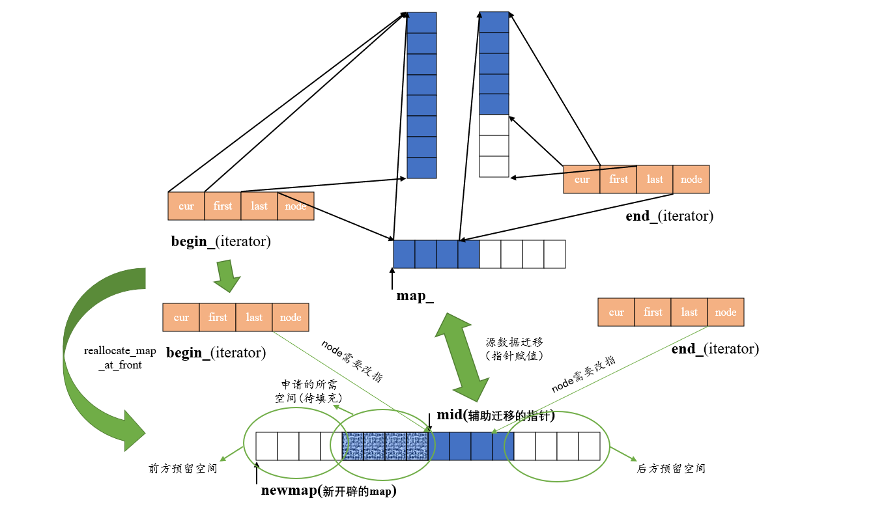
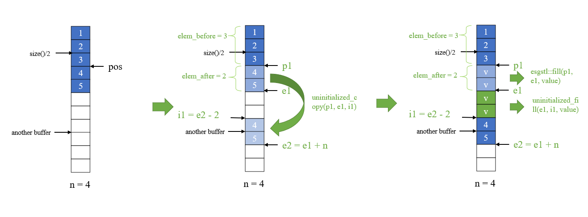
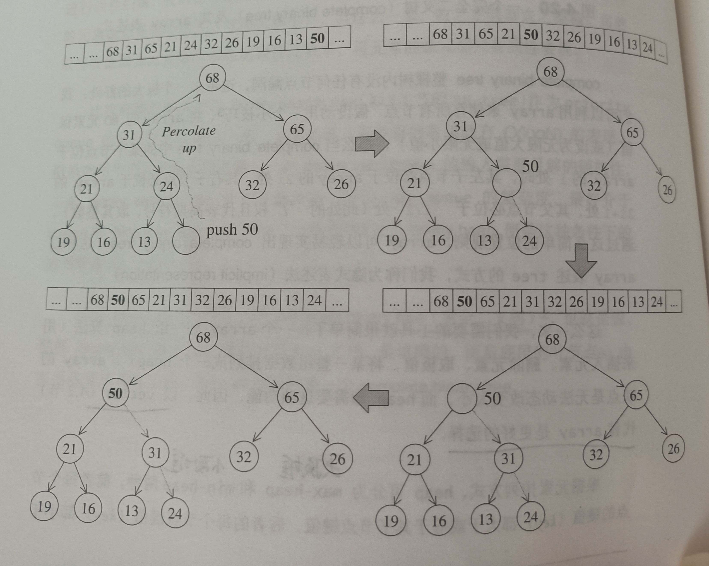
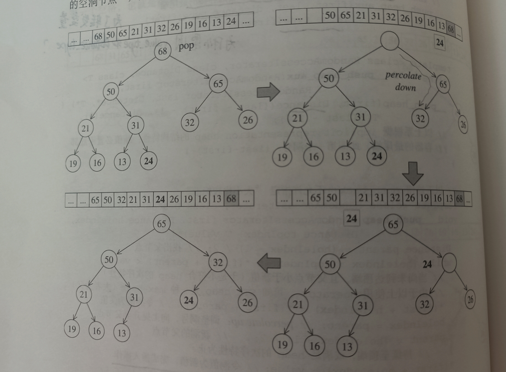
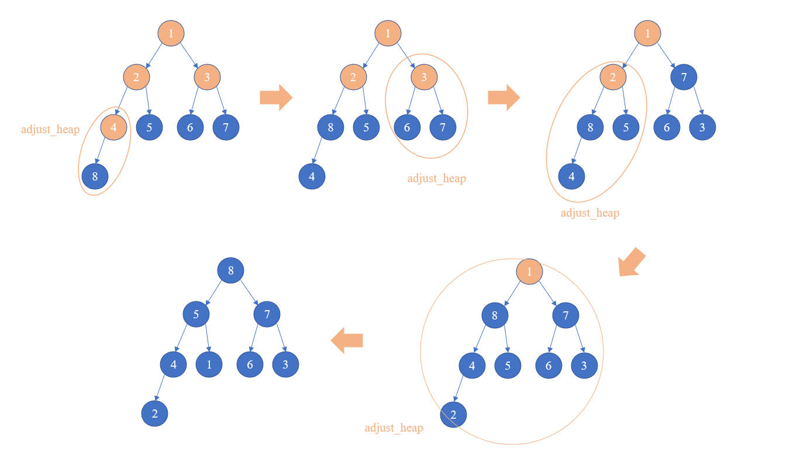
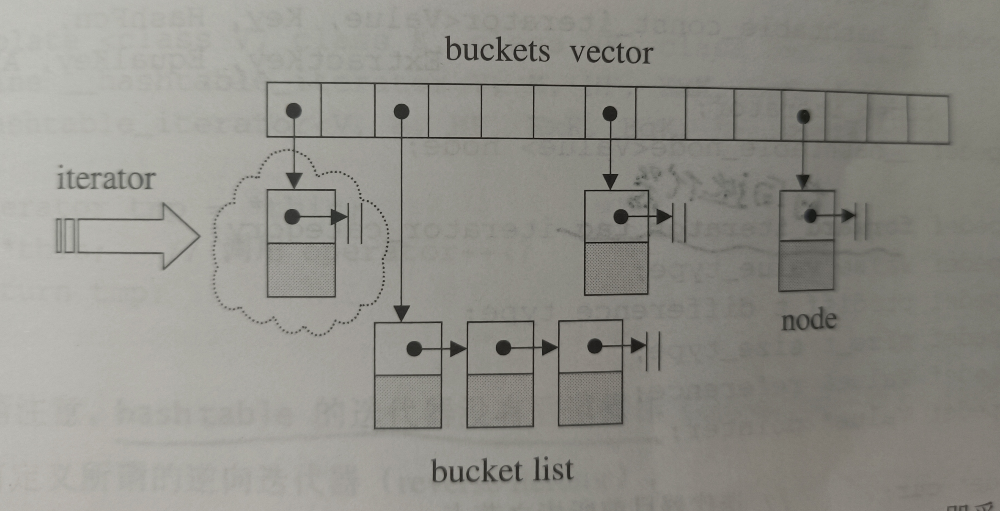

# 我的STL——esgstl开发笔记

## ①迭代器相关

### 【1】类型萃取器type_traits.h

- 介绍

  - 扮演着一个获取类型信息的中间人
  - 通过偏特化等方式可以一视同仁地萃取原生指针和迭代器的类型信息

- 实现

  - 直接调用STL的同名文件，其中包含大量不同的类型萃取器

    


### 【2】迭代器iterator.h

- 介绍

  - 迭代器是STL中容器与算法之间的胶粘剂
  - 在能够依序访问某个容器中所含的各个元素的前提下，又不暴露容器内部表述方式

- 头文件组成

  - |             组成部分             |                           具体内容                           |
    | :------------------------------: | :----------------------------------------------------------: |
    |          五种迭代器类型          | input_iterator_tag、output_iterator_tag、forward_iterator_tag、bidirectional_iterator_tag、random_access_iterator_tag |
    |           迭代器模板类           |                       struct iterator                        |
    |  帮助判断迭代器类型信息的模板类  | has_iterator_cat、iterator_traits_impl、iterator_traits_helper、iterator_traits、has_iterator_cat_of、 |
    |  真正用来判断迭代器类型的模板类  |                       is_×××_iterator                        |
    | 返回迭代器某种类型信息的模板函数 |         iterator_category、distance_type、value_type         |
    |             功能函数             |    distance_dispatch、distance、advance_dispatch、advance    |
    |            反向迭代器            |          class reverse_iterator、类外操作符重载函数          |
    |            插入迭代器            |         包括back_inserter、front_inserter和inserter          |
  
  


## ②内存分配相关

### 【1】内存分配函数construct.h

- 介绍

  - 本头文件主要辅助allocator在给定位置构造或析构对象

- 头文件组成

  |    组成部分     |             具体内容              |
  | :-------------: | :-------------------------------: |
  | construct函数簇 |         三个重载construct         |
  |  destroy函数簇  | destroy_one、destory_cat、destory |

  

### 【2】分配子allocator.h

- 前置知识

  - new、delete、malloc、free、::operater new 和 ::operater delete的区别

    > 构建和析构对应的区别差不多，下面以构建相关的new、malloc、::operater new进行说明
    >
    > - 首先，以所做的事情的范围来说的话，new中包含了::operater new 所做的事，::operater new 则包含了 malloc 做的事
    >
    > - 具体而言
    >
    >   - malloc是从C语言继承过来的内存分配函数，需要手动指定要分配的空间大小，分配不了的话会返回0
    >
    >   - ::operater new 准确来说有三种形式，抛出异常和不抛出异常的**throwing new**和**nothrow new** 以及 用来在给定指针所指的内存上调用构造函数的**placement new**
    >
    >   - 调用方式区别：
    >
    >     > ::operator new (size_t n) ==> throwing / nothrowing new
    >     >
    >     > ::operator (T* ptr) new(value) ==> placement new
    >
    >   - 
    >
    >   - 前两种形式 最终目的也是分配指定大小的内存给用户，但是允许用户重载这个运算符来调整内存分配的方式，并且允许用户自行设置系统无法分配内存时的处理手段，区别是是否会抛异常
    >
    >   - new关键字则是会自动计算所需内存，调用:: operater new 得到可用内存，再调用placement new 在这片内存上构建对象，最后返回指针

  - move和forward函数的含义与区别

    >template <class Function , class T1, class T2>
    >
    >​	void useFunction(Fuction f, T1&& a, T2&& b) {
    >
    >​		f(b,a);  										// ①
    >
    >​		f(move(b),move(a));				 // ②
    >
    >​		f(forward< T2 >(b),forward< T1 >(a));		// ③
    >
    >}
    >
    >1.无论a和b本身是左值还是右值，①式将会传递两个左值给f
    >
    >2.无论a和b本身是左值还是右值，②式将会传递两个右值给f
    >
    >3.③式则将a和b本身的值属性原封不动地转移给f
    >
    >**区别：**
    >
    >- move接收左值和右值，始终传回右值；forward拿到左值返回左值，拿到右值返回右值
    >- move不需要显式指定模板参数，forward必须要显式指定模板参数
    >
    >**为什么能做到这点？**
    >
    >1.首先观察源码：
    >
    >```cpp
    >// forward源码
    >template <class Ty>
    >_NODISCARD constexpr Ty&& forward(
    >   remove_reference_t<Ty>& _Arg) noexcept { // forward an lvalue as either an lvalue or an rvalue
    >   return static_cast<Ty&&>(_Arg);
    >}
    >
    >// move源码
    >template <class Ty>
    >_NODISCARD constexpr remove_reference_t<Ty>&& move(Ty&& _Arg) noexcept { // forward _Arg as movable
    >   return static_cast<remove_reference_t<Ty>&&>(_Arg);
    >}
    >```
    >
    >forward总是返回指定类型Ty 的右值类型，根据引用折叠，如果 Ty是引用类型，那么返回一个左值，如果Ty是普通类型，则返回一个右值
    >
    >move则总是返回推断类型Ty的去掉所有引用之后的右值类型，不管Ty是否是引用类型，都会返回一个右值
    >
    >2.要想配合forward的使用，**形参的设置也有讲究，a和b的类型分别为右值类型，利用引用折叠，如果a本身是左值，那么T1会被推断为引用类型，如果a本身是右值，T1则会被推断为普通类型**

- 介绍

  - 空间配置器allocator是容器向系统索要内存的必由之物
  - 主要负责容器空间的开辟/回收，容器内容的构造/析构

- 头文件组成

  |    组成部分     |         具体内容          |
  | :-------------: | :-----------------------: |
  | allocator模板类 | 类内typedef、系列静态函数 |

- 实现


### 【3】通用工具类/函数util.h

- 前置知识

  - enable_if类的使用

    >直接上源码：
    >
    >```cpp
    >template<typename _Tp>
    >	struct enable_if<true, _Tp>
    >	{ typedef _Tp type; }
    >```
    >
    >- enable_if 是一个模板类，而且第一个参数固定为true
    >- 当你使用它时，只有你给的前置条件是true的时候才有这个类，否则将会告诉编译器这是个一个不符合当前函数匹配的模板，直接无视当前模板

- 介绍

  - 工具函数包含了一些常用类pair和move、forward等常用函数

- 头文件组成

  |    组成部分    |                           具体内容                           |
  | :------------: | :----------------------------------------------------------: |
  |    常用函数    |               move、forward、swap、swap_range                |
  | 模板结构体pair | pair类内结构、重载的pair比较运算符、重载的pair的swap函数、make_pair |

  

### 【4】基础算法algobase.h

- 介绍

  - 包含了部分基础的算法

- 头文件组成

  |        组成部分         |                           具体内容                           |
  | :---------------------: | :----------------------------------------------------------: |
  |        max和min         |           二元比较函数，基础版本和自定义比较器版本           |
  |        iter_swap        |                      交换迭代器所指对象                      |
  |          copy           | 正向拷贝：控制器，输入/随机迭代器，用户接口，trivially拷贝赋值类型特化版本 |
  |      copy_backward      | 逆向拷贝：控制器，双向/随机迭代器，用户接口，trivially拷贝赋值类型特化版本 |
  |         copy_if         |         条件拷贝：控制器，输入/随机迭代器，用户接口          |
  |         copy_n          |     拷贝长度为n的区间：控制器，输入/随机迭代器，用户接口     |
  |          move           |     移动指定区间到指定位置：控，输入/随，用户，特化版本      |
  |      move_backward      |   反向移动指定区间到指定位置：控，双向/随，用户，特化版本    |
  |          equal          |           二元判等函数，基础版本和自定义比较器版本           |
  |         fill_n          | 在指定位置填充n个值：unchecked版本，用户接口，one-byte特化版本 |
  |          fill           | 将指定区间中的所有元素赋值为指定值：控，前向/随机，用户接口  |
  | lexicographical_compare | 区间字典排序逻辑比较：默认，自定义比较器，C字符串特化，用户接口， |
  |        mismatch         |       返回两个区间对不上的地方：默认，自定义比较器版本       |

  

  

### 【5】未初始化空间构造函数uninitialized.h

- 介绍

  - 放置了一系列配合allocator使用的批量构造未初始化区间的函数

- 头文件组成

  |       组成部分       |                           具体内容                           |
  | :------------------: | :----------------------------------------------------------: |
  |  uninitialized_copy  | 将指定区间复制到一段未构造的区间上：用户接口，是否为trivially拷贝赋值版本 |
  | uninitialized_copy_n | 将指定开头和长度的区间复制到未初始化的区间：用户接口，是否为trivially拷贝赋值版本 |
  |  uninitialized_fill  | 在指定未初始化区间填充指定值：用户接口，是否为trivially拷贝赋值版本 |
  | uninitialized_fill_n | 在指定未初始化指定起点和长度的区间填充指定值：用户接口，是否为trivially拷贝赋值版本 |
  |  uninitialized_move  | 将指定区间移动到一段未构造的区间上：用户接口，是否为trivially拷贝赋值版本 |
  | uninitialized_move_n | 将指定开头和长度的区间复制到未初始化的区间：用户接口，是否为trivially拷贝赋值版本 |

  

### 【6】动态内存管理memory.h

- 介绍

  - 包含了动态内存相关的类：临时缓冲区管理类、临时缓冲区分配析构函数、智能指针unique_ptr和weak_ptr、shared_ptr相关类

  - shared_ptr、weak_ptr实现细节

    - 类间关联

      > ptr_count : 结构体，只包含用于记录shared_ptr和weak_ptr数量的int
      >
      > ​									↓(包含其指针)															 ↓(包含其指针)
      >
      > ​	shared_ptr：可共享管理权的动态资源管理类，底层保存原生指针     weak_ptr：弱关联指针，依附shared_ptr存在
      
    - 共有函数
    
      - **release**：减少ptr_count指针记录的shared_ptr/weak_ptr的计数，如果共享指针数量为零，释放所管理的资源，如果弱关联指针数量为零，delete掉ptr_count的指针
      - reset：调用release，并使两个底层指针为nullptr
      
    - 独有函数
    
      - weak_ptr
        - **lock**：会检查底层ptr_count指针shared_ptr的计数，如果不为0，将自己作为构造参数返回一个shared_ptr，否则返回空shared_ptr
        - expire：返回底层指针ptr_count指针shared_ptr的计数是否为0
      - shared_ptr
        - unique：返回shared_ptr的计数是否为1
        - use_count：返回有多少个shared_ptr管理当前资源
        - reset(T* data)：重置shared_ptr，并作为第一个共享指针管理data的资源
      - make_shared(Args&&... args)
        - 内部new了对象并创建一返回个shared_ptr管理它
    
  - 头文件组成
  
    |        组成部分        |                           具体内容                           |
    | :--------------------: | :----------------------------------------------------------: |
    |  缓冲区分配\析构函数   |        get_temporary_helper、release_tmeporary_buffer        |
    | 模板类temporary_buffer | allocate_bufferfe：分配缓冲区，initialize_buffer：初始化缓冲区，私有的拷贝构造函数\赋值运算符阻止拷贝，无默认构造函数 |
    |       unique_ptr       |       reset()、release()不允许共享管理权的简易智能指针       |
    |       shared_ptr       |               ptr_count、weak_ptr、shared_ptr                |
  
    


## ③字符串相关

### 【1】字符串基类base_string.h

- 介绍

  - 字符串基类，其底层原理类似于动态分配的char型数组，即vector< char >

- 头文件组成

  |      组成部分      |                           具体内容                           |
  | :----------------: | :----------------------------------------------------------: |
  | char_traits模板类  | 静态方法：length、compare、copy、move、fill（实现方式同模板参数有关） |
  | basic_string模板类 |  底层维护一个字符数组buffer_，size _ 和 capacity _，一众API  |

- 遇到的bug

  - 模板方法在调用其他模板方法的时候，其他模板方法一定已经声明在当前方法前面了，否则会编译失败
  - 如果一个方法不改变当前对象，尽量将其声明为const，除非对const对象有什么特殊的处理逻辑
  - typedef的坑：typedef   T * iterator;后，const iterator指的是常量指针，而不是指向常量的指针，要想表示后者，在typedef的时候顺手typedef const T* const_iterator;之后用const_iterator就好了
  - 编译器报错：非法的间接寻址
    - 自己碰到这种是因为对一个已经是字符的值又提领了一次
    - chatGPT说还有可能是对未初始化指针、野指针（空悬指针）、越界的数组指针、空指针提领造成的错误
    - 碰到这种错误就检查*()操作的对象是否合法
  - C++标准库在C++20中将`std::is_pod`和`std::is_pod_v`特性标记为已弃用，并推荐使用`std::is_trivially_copyable`和/或`std::is_standard_layout`特性来替代。这是因为新的特性提供了更精确和更有用的类型特征
    - POD（Plain Old Data）是C++中的一个术语，它指的是一种具有简单、传统的数据结构和行为的类型。POD类型是一种在内存中以连续块的形式存储数据的类型，没有任何构造函数、虚函数、非静态成员变量等特殊属性
    - `std::is_trivially_copyable`：用于判断类型是否是"trivially copyable"（可平凡复制的）
    - 一个"trivially copyable"类型是可以通过`std::memcpy`等内存复制操作进行比特位复制的类型，而不需要执行任何特殊的构造、析构或拷贝操作
    - `std::is_standard_layout`：用于判断类型是否具有"standard layout"（标准布局）
    - 一个"standard layout"类型满足一组规则，包括没有虚函数、没有非静态数据成员有相同的地址、没有基类和派生类之间的空隙等，"standard layout"类型在内存中具有连续和可预测的布局


### 【2】字符串类astring.h

- 介绍
  - 这个头文件只是给basic_string几个特殊的实体类定义了别名
    - basic_string< char >  ==>  string
    - basic_string< wchar_t >  ==>  wstring
    - basic_string< char16_t>  ==> u16string
    - basic_string< char32_t>  ==> u32string


## ④顺序容器相关

### 【1】异常定义exceptdef.h

- 介绍
  - 定义了一些异常处理的宏
  - 包括了
    - ESGSTL_DEBUG(断言)
    - ESGSTL_LENGTH_ERROR_IF(满足一定条件抛出长度错误)
    - ESGSTL_OUT_OF_RANGE_IF(满足一定条件抛出越界错误)
    - ESGSTL_RUNTIME_ERROR_IF(满足一定条件抛出运行时错误)
- 实现
  - 头文件
    - 包含stdexcept，因为使用了std定义的一些异常
    - 包含cassert，是因为使用了断言功能


### 【2】动态数组vector.h

- 介绍
  - 定义了一种可以动态分配空间的数组
  - 这个数组可以
    - assign：重新定义
    - insert：指定位置插入
    - erase：指定区间删除
    - push_back/pop_back：尾部插入、尾部抛出
    - emplace/emplace_back：移动插入、尾部移动插入、
    - resize：缩小、扩大到指定尺寸
- 实现
  - 底层通过三个指针控制着原始数组，迭代器为原始指针
  - 头文件
    - #include <initializer_list>  // 使用了初始化列表
    - #include "iterator.h"	// 纳入迭代器体系
    - #include "memory.h"		// 开辟空间
    - #include "exceptdef.h"	// 使用了一些报错机制
    - #include "util.h"	// 使用了move、swap等工具函数


### 【3】双向环形链表list.h

- 介绍

  - 定义了一种只支持双向顺序访问的双向环形链表
  - 这个链表可以
    - assign：重新定义
    - insert：指定位置插入
    - erase：指定区间删除
    - push_front/pop_front：头部插入、头部抛出
    - push_back/pop_back：尾部插入、尾部抛出
    - emplace/emplace_back/emplace_front：移动插入、尾部移动插入、头部移动插入
    - resize：缩小、扩大到指定尺寸
    - splice：粘接别的list
    - remove：删除满足一定条件的元素
    - unique：去重
    - sort：排序

- 头文件组成

  |       组成部分       |                           具体内容                           |
  | :------------------: | :----------------------------------------------------------: |
  |  node_traits模板类   |                      只定义了两个重命名                      |
  | list_node_base模板类 | as_node(将自身指针当作list_node的指针返回)、self(将自身指针当作list_node_base的指针返回)、unlink(使自成环) |
  |   list_node模板类    | as_base(将自身指针当作list_node_base的指针返回)、self(将自身指针当作list_node的指针返回) |
  |   list_iterator类    |                list的迭代器，重载了一些运算符                |
  |      list模板类      |                 底层维护一个尾节点、一众API                  |

- 实现

  - 链表由两部分组成

    - 尾节点——一个base_node：只有prev和next指针
    - 元素节点——list_node：继承于base_node，拥有额外储存元素值的value成员

  - 链表初始化后，底层只保存尾节点，若没有其他元素节点，则它是自成环的，否则尾节点前一个元素的迭代器就是begin，本身的迭代器就是end

  - 链表迭代器是单独定义的，它是一种双向迭代器，重载了++和--、+=和-=以及==和!=操作符

  - 链表内容修改的精髓在于

    - link_iter_node：将元素节点node连接到list的环的iter位置之前,返回位置不变的新的iter
    - link_nodes：将[first,last]节点区间（不必成环）连接到list的环的p元素节点之前（图中n和p标反了）

    

    - link_nodes_at_front：将[first,last]节点区间（不必成环）连接到list的环的尾节点之前
    - link_nodes_at_back：将[first,last]节点区间（不必成环）连接到list的环的头元素节点之前
    - unlink_nodes：将[first,last]节点区间从区间所处的环中剥离出去

    

  - 头文件

    - #include <initializer_list>		// 引入初始化列表，接受{元素集}初始化
    - #include "iterator.h"			   // 加入迭代器规范
    - #include "memory.h"			 // 分配节点内存
    - #include "util.h"				      // 使用swap、move等工具函数
    - #include "functional.h"		 // 接受用户提供的一元谓词、二元谓词自定义行为
    - #include "exceptdef.h"		 // 使用了一些报错机制

- 遇到的bug

  - 编译器bug，如果一开始漏写了一些必要信息，如namespace名称，之后将不能ALT+ENTER生成类外代码，即便是补写了信息保存文件还是会有这个问题
    - 解决方法：ctrl a + ctrl x + ctrl v，选中所有文本，剪切再重新粘贴回文件保存即可


### 【4】双端队列deque.h

- 介绍

  - 定义了一种可以随机访问的双端输入输出队列
  - 它可以
    - assign：重新定义
    - insert：指定位置插入(元素、区间)
    - erase：指定位置删除(元素、区间)
    - push_front/push_back、pop_front/pop_back：头部/尾部插入、头部/尾部抛出
    - emplace/emplace_front/emplace_back：移动插入、头部/尾部移动插入
    - []：随机访问下标元素
    - resize：缩小、扩大到指定尺寸

- 头文件组成

  |       组成部分       |                          具体内容                           |
  | :------------------: | :---------------------------------------------------------: |
  | deque_iterator模板类 | deque的迭代器，底层维护了四个原始指针，封装了大量重载运算符 |
  |     deque模板类      | 双端队列，底层维护一个中控器指针、一对头尾迭代器和容器大小  |

- 实现

  - deque的结构

    

    > 中控器是存放buffer头指针的**指针数组**，map是这个指针数组的头指针，被deque所管理，deque还保存了begin_ 、end_(图中为start和finish)两个迭代器，分别指向头元素节点和尾节点，还保存了中控器map所包含的node数量

    > deque_iterator，迭代器管理四个底层指针，cur指向迭代器所指的真实元素，first和last指向元素所在buffer的空间首尾位置，node指向这个buffer所在的中控器的位置

  - 重点函数原理图解

    - reallocate_map_at_front/reallocate_map_at_back

    

    > 两个方法原理相似，以at_front为例说明：
    >
    > 当前方的空间不足以放下需要新放入的元素时，会调用这个方法，传入需要的map_node个数，它会计算新的map_node个数，要么现在的个数翻倍，要么现在的个数+8+需要的map_node个数。
    >
    > 调用create_map创建新的map后，接下来将源数据迁移到新的map上，这里buffer头指针的转移，不用费很大劲，转移的位置也有讲究，前后都会重新预留相同大小的区间，根据是在前申请新空间还是在后申请新空间，将源数据移到mid之前或者之后，转移后，会析构掉原来的map，重新设置deque的begin_ 和end_ 两个迭代器

    - insert系列(fill_insert、copy_insert)

    

    > 插入元素时会考虑包括pos相对begin_的位置（在前半段还是后半段），插入的元素个数（比pos前的元素多还是少，比pos后的元素多还是少）在内的因素，根据插入时的不同情况来采取不同的拷贝和拷贝构造手段，总纲领是：将应该放插入元素的位置上的元素，挪到自己正确的位置，如果正确的位置是未初始化区域，使用uninitialized系列函数，若是已经存在元素的位置，使用copy、fill等工具函数
    >
    > 上图是fill_insert时，pos位于后半段，n大于elem_after的情况时的处理手法

  - 头文件

    - #include<initializer_list> // 引入初始化列表，接受{元素集}初始化
    - #include"iterator.h"	// 使用了difference_type等返回迭代器属性的方法
    - #include"exceptdef.h"	// 使用了一些报错机制
    - #include"memory.h"		// 分配中控器，buffer的内存
    - #include"util.h"		// 使用了swap、move等工具函数

- 遇到的bug

  - **错误	C2678	二进制“-”: 没有找到接受“const esgstl::deque_iterator<T,T &,T *>”类型的左操作数的运算符(或没有可接受的转换)**
    - 解决方法：重载的操作符没有标识为const，const 的对象无法调用


### 【5】栈stack.h

- 介绍
  - 基于双端队列实现了一种先进后出的数据结构
  - 它可以
    - top： 访问栈顶元素
    - empty：查询是否为空
    - size：查询栈中元素个数
    - emplace：就地构造元素压入栈中
    - push：将元素压入栈中
    - pop：将栈顶元素吐出
    - clear：清空栈
- 实现
  - 底层默认存储了一个deque，stack的所有功能只需要选择性地开放deque的接口即可


### 【6】堆heap_algo.h

- 介绍

  - 实现了堆相关的算法
  - 它可以
    - push_heap：将尾部元素纳入堆中，并维护堆的堆属性和完全二叉树属性
    - pop_heap：将堆顶元素剔除出堆，并维护堆的堆属性和完全二叉树属性
    - make_heap：接受一对随机迭代器，将其排序为堆结构
    - sort_heap：将给定堆排序

- 实现

  - push_heap

    

    >**上溯过程，其实就是不断地将原先位于空洞的值，与比它小的父节点的值互换**，图中，包括源码实现使用的是空洞的概念，记录空洞原值，再使空洞不断被小的父节点的值填补，而父节点变为空洞，继续向上查找，直到父节点比空洞元素的值要更大或者到达了根节点，而后将空洞填补为空洞原值

  - pop_heap（adjust_heap）

    

    > 将顶部元素吐出不仅会使得顶部产生空洞，即便依次将大值向上填充后（下溯）仍然会出现不符合堆属性的情况，因此还需要进行一次上溯，上图其实没有很好地展示下溯后再一次上溯的情况，68弹出（将其放到24的位置，在这之前记录24为空洞原值），65大往上走，子节点中32大，往上走，空洞留在了原来32的位置，此时进行上溯，24小于32因此不需要上移。
    >
    > 将分支（31—>13,14）修改为（48—>46,47）就会观察到最后的上溯现象

  - make_heap

    

    > **倒序对所有具有叶子节点的父节点进行adjust_heap**，记录父节点的值为空洞值，进行下溯加上溯的过程，整理完后整个树就具有了堆属性
    >
    > 上图以值为1-8的底层数组进行排序示例

  - sort_heap

    - 依次缩短区间，pop_heap即可


### 【7】队列/优先队列queue.h

- 介绍
  - 基于双端队列实现了一种先进先出的数据结构queue
  - 它可以
    - front/back： 访问队首/尾元素
    - empty：查询队列是否为空
    - size：查询队列中元素个数
    - emplace：就地构造元素压入队列中
    - push：将元素压入队列中
    - pop：将队首元素吐出
    - clear：清空队列
  - 基于堆算法和vector容器实现了一种有序的队列
  - 它可以
    - top： 访问队首（堆顶）元素
    - empty：查询是否为空
    - size：查询优先队列中元素个数
    - emplace：就地构造元素压入优先队列中
    - push：将元素压入优先队列中
    - pop：将队首（堆顶）元素吐出
    - clear：清空队列
- 实现
  - queue的底层默认存储了一个deque，queue的所有功能只需要选择性地开放deque的接口即可
  - priority_queue的底层默认存储了一个vector，使用heap的算法，始终维持vector 的堆属性和完全二叉树性质


## ⑤关联容器相关

### 【1】红黑树rb_tree.h

- 介绍

  - 实现了一种可以对有名项排序且支持快速增删改查的平衡查找二叉树
  - 它可以
    - emplace_multi/empalce_unique：就地插入元素（可重复/不可重复）
    - insert_multi/insert_unique：拷贝插入元素（可重复/不可重复）
    - erase_multi/erase_unique：删除指定键值元素（多删/单删）
    - count_multi/count_unique：计算给定键值元素在结构中存储的数量
    - find：找到结构中存放的第一个带给定键值的元素
    - lower_bound/upper_bound：找到给定键值能够插入的最前/后的位置
    - equal_range_multi/equal_range_unique：查询元素区间（多元素/单元素）

- 头文件组成

  |          组成部分           |                           具体内容                           |
  | :-------------------------: | :----------------------------------------------------------: |
  | rb_tree_value_traits模板类  | 提供用户使用的红黑树存储数据类型提取器，类中定义了静态函数get_key和get_value函数，可以根据推断的类类型调用正确的取值函数 |
  |   rb_tree_node_base模板类   | 红黑树的基础节点，底层维护了指向left、right和parent的指针以及代表节点颜色的布尔值，定义了将自身强转为node指针的函数 |
  |     rb_tree_node模板类      | 红黑树的节点模板类，继承自基础节点类，多了一个装value的属性  |
  |    rb_tree_traits模板类     | 最顶层的类型提取器，放在rbtree模板类内部用来提取各种所需的类型 |
  | rb_tree_iterator_base模板类 | 红黑树的基础迭代器类型，底层维护了一个指向基础节点类型的指针，定义了前进和后退两个函数，以及相等和不相等的函数 |
  |   rb_tree_iterator模板类    | 红黑树的迭代器类型，继承自基础迭代器类型，底层仍然维护基础节点类型的指针，重载了++、--、*、和->等操作符 |
  |     红黑树通用模板函数      | 包括左旋、右旋、找最左节点、找最右节点、是否是红/黑节点、是否是左/右子节点的模板函数，以及用于平衡红黑树的插入后平衡、删除后平衡的模板函数 |
  |        rb_tree模板类        | 红黑树模板类，底层维护一个指向红黑树头节点（非根节点）的基础节点指针、红黑树节点数量、键值比较函数子 |

- 前置知识

  - 红黑树的规则

    1. 小值在左，大值在右，满足查找二叉树的要求
    2. 节点有红黑两种颜色，根节点一定为黑，位于路径结尾的空指针认为是黑
    3. 每条从根节点出发到空指针结尾的路径，黑节点的数量都要相等
    4. 新增节点为红色，红色节点不能相邻

  - 调整树的操作

    1. 左旋

       ```cpp
       	/*---------------------------------------*\
       	|       p                         p       |
       	|      / \                       / \      |
       	|     x   d    	  左旋x节点      y   d     |
       	|    / \       ===========>    / \        |
       	|   a   y                     x   c       |
       	|      / \                   / \          |
       	|     b   c                 a   b         |
       	\*---------------------------------------*/
       	// 左旋节点，即让目标节点的右子节点来代替自己的位置
       	// 因此进行左旋的目标节点必须有右节点
       	// 左旋的目的及结果是减少右子树的路径长度，增加左子树的路径长度
       ```

    2. 右旋

       ```cpp
       	/*----------------------------------------*\
       	|     p                         p          |
       	|    / \                       / \         |
       	|   d   x       右旋x节点	    d   y        |
       	|      / \     ===========>      / \       |
       	|     y   a                     b   x      |
       	|    / \                           / \     |
       	|   b   c                         c   a    |
       	\*----------------------------------------*/
       	// 右旋节点，即让目标节点的左子节点来代替自己的位置
       	// 因此进行右旋的目标节点必须有左节点
       	// 右旋的目的及结果是减少左子树的路径长度，增加右子树的路径长度
       ```

  - 平衡树的操作

    1. 插入节点后平衡

       ```cpp
       	// 插入新节点后，需要平衡红黑树,插入的情况比较少，按模式来分的话只有三种
       	// 1.父节点是黑节点，不用处理，直接是平衡的（父黑）
       	// 2.父节点是红的，并且叔节点也是红的，这时两边黑节点数在没插入节点之前肯定就是相等的，只需要处理不让红节点
       	// 相邻即可，将父节点和叔节点都变黑，而爷节点变红，爷节点的子树就平衡了，但是整颗树不一定平衡，将爷节点所在
       	// 子树想象成一个新插入的红节点，再去递归平衡整棵树（父红叔红）
       	// 3.父节点是红的，叔节点是黑的，现在再插入一个红节点，那父节点这边怎么说也比叔节点那边要长2（父红叔黑）
       	// 因此要通过旋转手段匀一点去叔子树那边
       	// 如果爷-父-子在同一条线上，那好办，就旋转爷节点就可以，但是如果不在一条直线上，则需要先旋转一次父节点
       	// 旋转完爷节点后，使父节点变黑，爷节点变红即可
       ```

    2. 删除节点后平衡

       ```cpp
       	// 指定要删除的节点，平衡红黑树
       	// 删除的情况比较复杂，正向思维的代码容易让人感到混乱
       	// 总共有4种模式：①单个红节点（直接删除） ②拥有一个红节点的黑节点（红黑节点值互换，删除红）
       	// ③拥有两个子节点，找到能够替代自己的最接近的节点，互换节点值，再按①②处理
       	// ④单个黑节点，将与兄节点和侄节点的颜色有关，又细分四种情况
       	// 因此，需要想办法再精简一下，将除了④以外的情况都弄成一种情况
       	// 经过观察，①②③总是收敛到①，即最后都变成了直接删掉红节点的情况
       	// 所以采用逆向思维，先找到删掉z这个节点之后会填到这个节点上去的替代节点x
       	// 这个节点的颜色受到待删除节点以及自身颜色的双重影响，会有红+黑、黑+黑的情况，前者对应①②③，后者对应④
       
       	// ④又根据兄节点的颜色及侄节点的颜色分成4种情况
       	// [1] 兄红，则双侄必为非空黑节点，父必为黑
       	// 这样兄那边就太长了，需要旋转来均衡两边的路径长，因此先旋转父，然后兄变黑，父变红，再重新调整
       	// [2] 兄黑，双侄黑，父可黑可红，若父红，则兄红父黑则平衡结束
       	// 若父本来就黑，前述操作使得父节点子树的黑节点数量都少了1，因此调整对象变为父子树，继续调整
       	// [3] 兄黑，对侄红，父可黑可红，说明兄那边有一条路径太长了，要旋转来均衡一下两边的路径长
       	// 先旋转父，兄变父的颜色，父、对侄变黑则平衡结束
       	// [4] 兄黑，顺侄红，父可黑可红，和上一种情况很像，但是直接旋转父并不能平衡
       	// 因此先旋转兄，对调兄和顺侄颜色，再重新调整（下次进入循环会被判定为[3]）
       ```

- 实现

  - 头节点header
    - header不存放实值，只有三个指针
    - parent指向红黑树根节点
    - right指向红黑树最右侧的节点
    - left指向红黑树最左侧的节点
  - 头文件
    - #include<initializer_list>	// 允许使用多个相同类型的不定量形参来初始化红黑树
    - #include< cassert >            // 使用了一些编译时的模板类型的判断
    - #include "functional.h"      // 使用了一些预先定义的函数子
    - #include "iterator.h"           // 使用了预先给定的迭代器基类
    - #include "memory.h"          // 使用了allocator来管理空间
    - #include "type_traits.h"      //  使用了一些类型萃取手段
    - #include "exceptdef.h"       // 使用了一些发生错误时的断言
    - #include "util.h"                   // 使用了swap、pair、move等工具函数


### 【2】有序集合与可重复有序集合set.h

- 介绍
  - 基于红黑树，实现了允许键值重复以及不允许键值重复的有序集合
  - 两者底层都保存一个rb_tree，用户需要指定Key的类型作为红黑树的value(const Key)类型
  - 如果不指定用于比较键值的函数子，则默认使用less< T >
  - 有序集合与可重复有序集合使用了rb_tree的不同API，但两者本身API完全一致，它们可以：
    - emplace：就地构建元素插入
    - insert：插入给定元素/区间
    - erase：删除给定键值/迭代器对应的元素/区间
    - count：查找给定键值的元素在集合中出现了几次
    - find：返回给定键值的元素的迭代器
    - lower_bound：返回不小于给定键值元素的第一个节点的迭代器
    - upper_bound：返回大于给定键值元素的第一个节点的迭代器
    - equal_range：返回给定键值元素出现在集合中的区间（一对迭代器）
    - set_max_load_factor：设置底层hashtable的负载系数


### 【3】有序映射与有序多映射map.h

- 介绍
  - 基于红黑树，实现了允许键值重复以及不允许键值重复的有序映射
  - 两者底层都保存一个rb_tree，用户需要指定Key和T的类型组合成pair作为红黑树的value(pair<const Key, T>)类型
  - 如果不指定用于比较键值的函数子，则默认使用less< T >
  - 有序映射与有序多映射使用了rb_tree的不同API，但两者本身API基本完全一致，同有序集合
  - 有序映射较为特别，它允许用户使用[key] = value的方式插入键值对，若key已经存在于映射中，该语句将会改变对应值为value，否则将会插入(key,value)


### 【4】哈希表hashtable.h

- 介绍

  - 实现了一种可以对有名项（name item）快速增删改查的类字典数据结构hashtable
  - 它可以
    - emplace_multi/empalce_unique：就地插入元素（可重复/不可重复）
    - insert_multi/insert_unique：拷贝插入元素（可重复/不可重复）
    - erase_multi/erase_unique：删除指定键值元素（多删/单删）
    - count：计算给定键值元素在结构中存储的数量
    - find：找到结构中存放的第一个带给定键值的元素
    - equal_range_multi/equal_range_unique：查询元素区间（多元素/单元素）
    - set_max_load_factor：设定结构的最大负载系数

- 头文件组成

  |            组成部分            |                           具体内容                           |
  | :----------------------------: | :----------------------------------------------------------: |
  |    hashtable_iterator模板类    | hashtable的迭代器，底层维护了指向节点和指向哈希表的两个原始指针，属前向迭代器，只重载了*、->、++和== |
  | hashtable_const_iterator模板类 | 指向常量的迭代器，底层维护了指向节点和指向哈希表的两个原始指针，属前向迭代器，只重载了*、->、++和== |
  |        hashtable模板类         | 底层维护链表vector、vector尺寸、所存元素个数、最大负载系数、hash仿函数、判等仿函数、取键仿函数七个元素 |

- 实现

  - hashtable结构

    

  - 头文件

    - #include "iterator.h"	// 设计了hashtable的迭代器
    - #include "exceptdef.h"	// 使用了一些异常处理
    - #include "memory.h"		// 创建和构造节点
    - #include "functional.h"	// 使用了预先定义的仿函数作为默认参数
    - #include "util.h"		// 使用了swap、forward等函数
    - #include "vector.h"		// 作为底层容器存储链表
    - #include "algobase.h"	// 使用了lower_bound

- 遇到的bug

  - 声明了类的友元函数，将其定义在类外，报错，找不到友元函数的声明
    - 解决方法，将友元函数定义在类内


### 【5】无序集合与可重复无序集合unordered_set.h

- 介绍
  - 基于hashtable实现了一种字典集合的数据结构
  - 两种集合底层都维护了一个类型为 hashtable<T, T, HashFcn, identity< T >, EqualKey>的hashtable
  - ExtractKey是从存储的值里取出键值的仿函数，集合里直接存储键值，因此hashtable使用了identity< T >忠实地返回传入值
  - 无序集合与可重复无序集合使用了hashtable的不同API，但两者本身API完全一致，它们可以：
    - emplace：就地构建元素插入
    - insert：插入给定元素/区间
    - erase：删除给定键值/迭代器对应的元素/区间
    - count：查找给定键值的元素在集合中出现了几次
    - find：返回给定键值的元素的迭代器
    - equal_range：返回给定键值元素出现在集合中的区间（一对迭代器）
    - set_max_load_factor：设置底层hashtable的负载系数


### 【6】无序映射与无序多映射unordered_map.h

- 介绍
  - 基于hashtable实现了一种字典映射的数据结构
  - 两种映射底层都维护了一个类型为hashtable<esgstl::pair<const Key,Value>,Key,HashFcn,select1st<esgstl::pair<const Key, Value>>,EqualKey>的hashtable
  - ExtractKey是从存储的值里取出键值的仿函数，映射里存储键值对，因此hashtable使用了select1st<esgstl::pair<const Key, Value>>返回传入键值对的第一个元素
  - 无序映射与无序多映射使用了hashtable的不同API，但两者本身API基本完全一致，同无序集合
  - 无序映射较为特别，它允许用户使用[key] = value的方式插入键值对，若key已经存在于映射中，该语句将会改变对应值为value，否则将会插入(key,value)


## ⑥算法相关

### 【1】仿函数functional.h

- 介绍（来自ChatGPT）

  - 仿函数（Functor）是一种重载了函数调用运算符（operator()）的对象，可以像函数一样被调用。它是C++中的一种可调用对象，可以将其视为一种特殊的函数对象。
  - 仿函数的作用是提供一种灵活的方式，使对象能够被当作函数来使用。通过重载函数调用运算符，可以在对象中定义自己的行为，并且可以像函数一样对其进行调用，传递参数并返回结果。
  - 使用仿函数的好处包括：
    1. 可替代函数指针：仿函数提供了一种**比函数指针更安全和灵活的方式**来实现回调机制。它可以在不暴露函数指针的情况下，将一个对象的某个成员函数作为回调函数传递给其他函数或算法。
    2. 封装状态：仿函数是对象，因此可以封装自己的状态和数据。它可以通过构造函数和成员变量来初始化和保存状态，从而在每次调用时保留状态。
    3. 函数对象适配器：通过使用适当的函数对象适配器，可以将仿函数与现有的算法和容器进行结合，从而**扩展其功能或自定义其行为**。例如，STL中的算法std::transform和std::sort可以接受仿函数作为参数，以自定义元素的转换和排序方式。
    4. 泛型编程：仿函数是泛型编程的重要组成部分。通过使用仿函数，可以**将算法和容器与特定的操作和行为分离开来，从而提高代码的可重用性和通用性**。

- 前置知识

  - ESGSTL的functional头文件包括了
    - 两种仿函数基类（单参数、双参数）
    - 算术运算类仿函数
    - 关系运算类仿函数
    - 逻辑运算类仿函数
    - 证同（返回自身）、选择（返回pair其一参数）、投射（双参二选一返回）
    - 哈希仿函数
  - 其中，证同、选择和投射只是忠诚地返回传给自己参数的一部分，目的是提供一层间接性，在map和set中将会有所体现
  - 哈希仿函数只定义了整型、浮点型数字和指针类型的特化版本，其他类型需要有效的hash函数需要自行特化

- 头文件组成

  |     组成部分     |                           具体内容                           |
  | :--------------: | :----------------------------------------------------------: |
  |    仿函数基类    |               unary_function、binary_function                |
  |   算术类仿函数   |       plus、minus、mutiplies、divides、modulus、negate       |
  |   关系类仿函数   | equal_to、not_equal_to、less、less_equal、greater、greater_equal |
  |   逻辑类仿函数   |             logical_and、logical_or、logical_not             |
  | 证同、选择、投射 | identity、select1st、select2nd、projectfirst、projectsecond  |
  | 证同元素取出函数 |  identity_element(plus<T>)、identity_element(mutiplies<T>)   |

- 实现

  

### 【2】数值算法numeric.h

- 包括了和数值相关的算法
  - accumulate：接受一对迭代器和初值init，返回其与区间值累加和
  - adjacent_diffence：接收一对迭代器，输出向前逐位差
  - inner_product：接收一对迭代器和另一个区间的迭代器，计算两个区间的内积（或其他给定运算）
  - partial_sum：接收一对迭代器，将区间初值和累加和（或其他二元操作）输出
  - power：接收一个原始值及幂次，计算幂运算后的结果（使用了快速幂的思想）


### 【3】集合算法set_algo.h

- 包括了集合相关的算法（集合由迭代器输入）
  - set_union：求并A∪B，输出并集
  - set_intersection：求交A∩B，输出交集
  - set_difference：求差A-B，输出差集
  - set_symmetric_difference：求对称差(A-B)∪(B-A)，输出对称差集


### 【4】其他算法algo.h

- 包括了算法库里没被分类的所有其他算法
  - 几乎所有算法，只要涉及到元素比较，均提供了两个版本：默认使用<比较/使用仿函数Compare比较
  - 详见excel
- 遇到的bug
  - 特殊初值造成的死循环
    - 当调用层级或选择性调用过深，过多，会导致一些顶层的函数具体实现无法第一时间确定
    - 因此，底层的函数在实现其功能时，必须考虑特殊情况，极端情况，以及无需处理的情况，将其首先排除，不进入后面的逻辑，否则容易在出现一些特殊输入的时候陷入莫名奇妙的死循环


### 【5】算法整合文件algorithm.h

- 整合了esgstl 的所有算法，包括
  - 基本算法：algobase
  - 数值算法：numeric
  - heap 算法：heap_algo
  - set 算法：set_algo
  - 其他算法：algo

